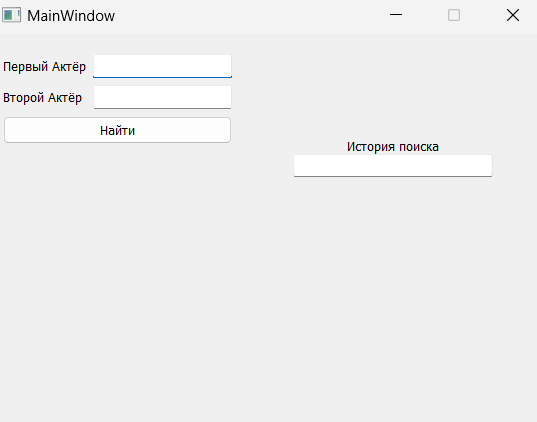
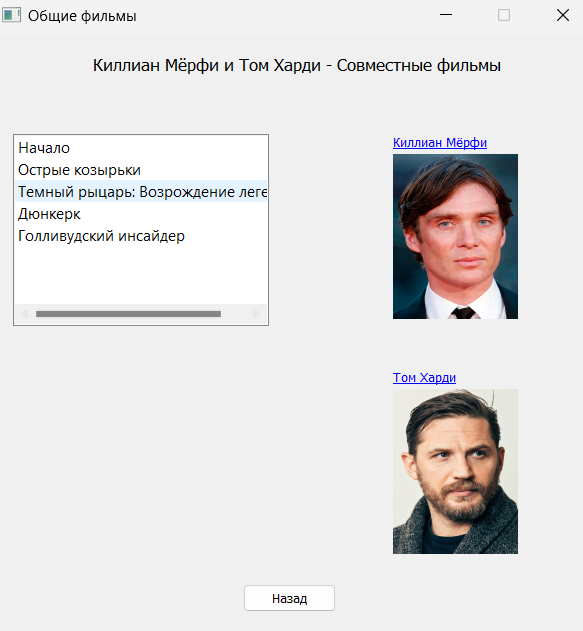
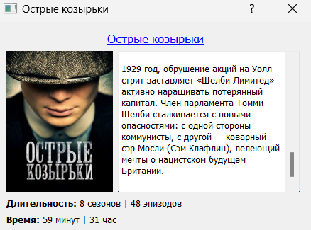
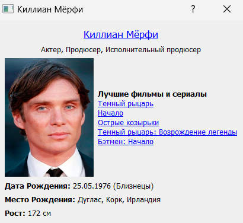

# CommonFilmsQtApp

**CommonFilmsQtApp** — это десктопное приложение на **Python (PyQt)**, которое ищет фильмы, в которых снимались два заданных актёра вместе.

---

## Главное окно


---

## Результаты поиска




---

## Возможности
- Ввод имён двух актёров и поиск общих фильмов.  
- Парсинг данных с сайта **film.ru** при помощи **BeautifulSoup**.  
- Отображение результатов в удобном графическом интерфейсе.  
- Ведение истории последних поисков.

---

## Технологии
- **Python 3.10+**  
- **PyQt5**  
- **BeautifulSoup4 (bs4)**  
- **Requests**

---

## Установка и запуск
```bash
git clone https://github.com/username/CommonFilmsQtApp.git
cd CommonFilmsQtApp
pip install -r requirements.txt
python main.py
